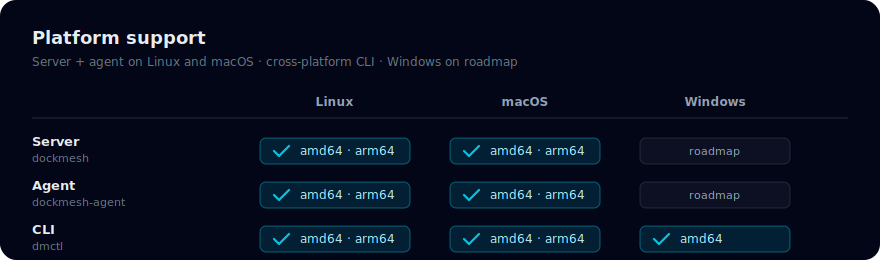
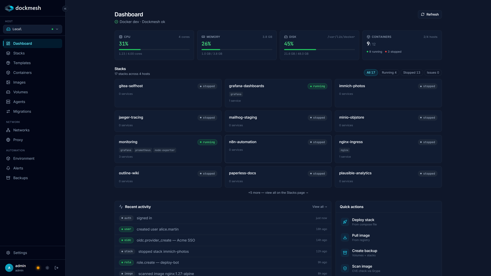
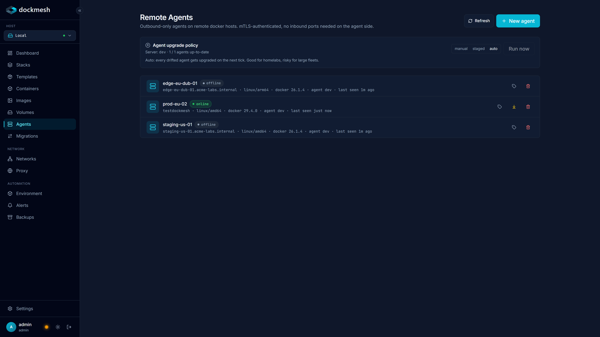
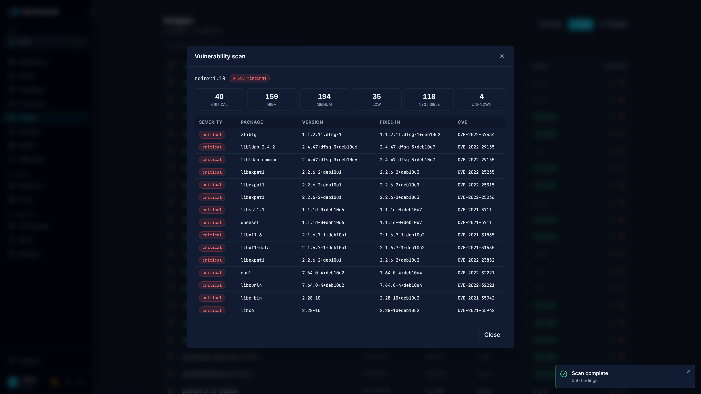
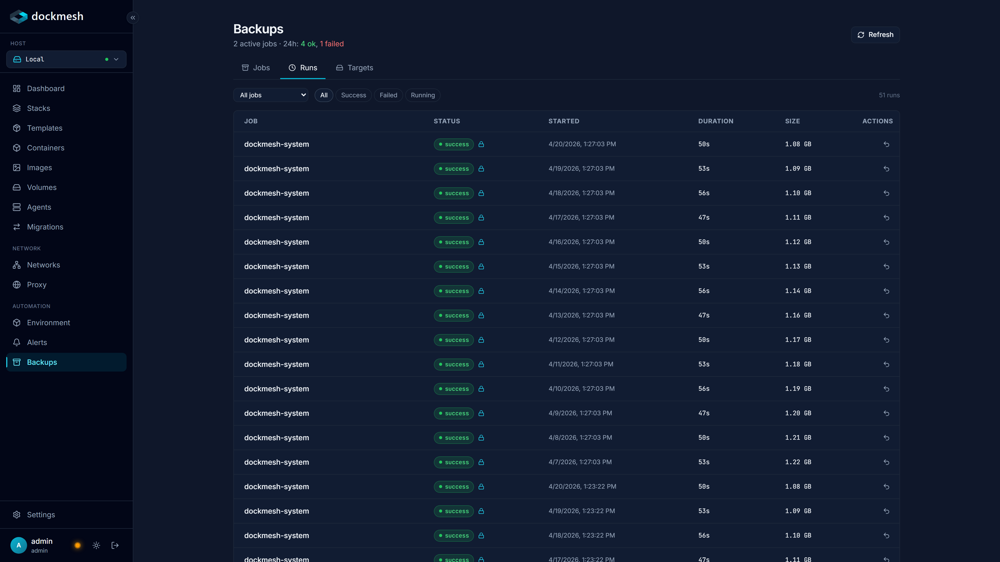
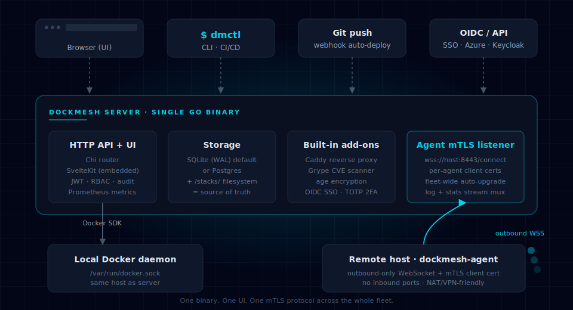

<p align="center">
  
</p>

<p align="center">
  <b>The single-binary Docker fleet manager. 100% open source. No paywalls.</b>
</p>

<p align="center">
  <a href="https://github.com/dockmesh/dockmesh/releases/latest"></a>
  <a href="https://github.com/dockmesh/dockmesh/actions/workflows/release.yml"></a>
  <a href="LICENSE"></a>
  <a href="https://dockmesh.dev"></a>
</p>

---

dockmesh is a lightweight Docker fleet-management platform. One Go binary,
one SvelteKit UI, outbound-only agents on every other host. Stacks live on
disk as plain `compose.yaml` files — the filesystem is the source of truth,
the DB just indexes it. RBAC, SSO, audit log, encrypted backups, CVE
scanning, and multi-host orchestration ship free in the single binary —
no "community edition", no feature gates, no per-node pricing.

## One-line install

```bash
curl -fsSL https://get.dockmesh.dev | sudo bash
sudo dockmesh init
```

That pulls the latest release binary to `/usr/local/bin/dockmesh` and walks
you through first-run setup: data directory, admin user, listen port,
optional systemd unit. Two minutes, then browse to `http://<host>:8080`.

Prefer Docker? See [Docker Compose](#docker-compose) below.

## Platform support

<p align="center">
  
</p>

Server + agent run natively on both Linux (systemd, `/var/lib/dockmesh`) and macOS (launchd, `/usr/local/var/dockmesh`) as of v0.1.5. The install script detects the host OS and sets up the right service manager; one-line install works identically on either. The `dmctl` CLI is additionally built for Windows so Windows users can drive a dockmesh server from their workstation. Native Windows server/agent support is on the roadmap.

## Features

Everything is included in the single binary. There is no paid tier.

<table>
<tr><td>

**Container & Stack management**
- Compose-first: stacks are `stacks/<name>/compose.yaml`
- Deploy / stop / restart / scale / rolling update
- Rollback history (snapshot compose + resolved images per deploy)
- Stack dependencies (base-stacks deploy first, refuse delete on deps)
- Env overrides + global env vars injected at deploy time
- Git source: auto-pull + auto-deploy on push or webhook
- Templates gallery (one-click deploys)

</td><td>

**Multi-host fleet**
- Outbound-only mTLS agents (no inbound ports on remote hosts)
- Per-host picker + `all` mode fan-out views
- Deploy stacks to any host from the same UI
- Stack migration across hosts (P.9 preflight + volume stream)
- Host-tag RBAC scopes (per-team isolation)
- Fleet-wide agent auto-upgrade on server version change

</td></tr>
<tr><td>

**Security**
- Custom RBAC roles with granular permissions
- OIDC SSO — Azure AD, Google, Keycloak, Okta, Authentik, Dex
- TOTP 2FA + single-use recovery codes
- SHA-256 hash-chained audit log
- age-encrypted stack `.env` files (zero plaintext on disk)
- In-place age key rotation (no service restart)

</td><td>

**Observability**
- Live CPU / memory / disk per host with smoothed metrics
- Live container stats + log streaming with auto-reconnect
- Container exec over WebSocket
- Alert rules (CPU/memory thresholds, configurable durations)
- Webhooks + notification channels (Slack, Discord, email)
- Prometheus `/metrics` endpoint

</td></tr>
<tr><td>

**Backups & DR**
- Scheduled backups of volumes, stacks, or whole system
- Pre/post hooks for application-consistent DB dumps
  (PostgreSQL / MySQL / MariaDB / Redis / MongoDB)
- Local, SMB (NAS), SFTP, WebDAV, or S3 targets
- Encrypted with age — the same key the stack `.env` uses
- One-click restore + verify-by-run (extract to /tmp, sanity-check,
  discard — never touches the live install)

</td><td>

**Networking & Extras**
- Embedded Caddy reverse proxy with automatic HTTPS
- Per-host port-conflict detection at deploy time
- Grype CVE scanner integration (image-level + fix-in column)
- Private registry credentials (age-encrypted at rest)
- `dmctl` CLI for CI/CD + scripted deploys
- Single binary — runs on a Raspberry Pi or a 500-host fleet

</td></tr>
</table>

## Screenshots

See [dockmesh.dev](https://dockmesh.dev) for the live marketing carousel with all
hero shots.

| | |
| :-: | :-: |
|  |  |
| Dashboard with live fleet overview | Multi-host agents with mTLS |
|  |  |
| CVE scanning via Grype | Scheduled encrypted backups |

## Architecture

<p align="center">
  
</p>

- **Single binary**. Go 1.23+, SvelteKit UI embedded via `go:embed`. No sidecars, no helm-chart, no external runtime deps beyond Docker itself.
- **Filesystem as source of truth**. Stacks live at `stacks/<name>/compose.yaml`. The DB indexes deployment state; the actual config is always on disk where you can grep, `git log`, and `vim` it.
- **Outbound-only agents**. Remote hosts open a WebSocket to the server — no inbound port to firewall, no VPN, no reverse tunnel. mTLS client certs per agent, revokable.
- **No Kubernetes**. Docker + Compose + a spine of management tooling. If you want K8s, use Rancher. If you want zero-config Docker across a fleet, use dockmesh.

## Install options

### Bare-metal / VM (recommended)

```bash
curl -fsSL https://get.dockmesh.dev | sudo bash
sudo dockmesh init
sudo systemctl enable --now dockmesh
```

### Docker Compose

```yaml
services:
  dockmesh:
    image: ghcr.io/dockmesh/dockmesh:latest
    restart: unless-stopped
    ports:
      - "8080:8080"
      - "8443:8443"  # agent mTLS listener
    volumes:
      - /var/run/docker.sock:/var/run/docker.sock:ro
      - ./data:/var/lib/dockmesh/data
      - ./stacks:/var/lib/dockmesh/stacks
    environment:
      DOCKMESH_BASE_URL: https://dockmesh.example.com
```

### Install an agent on a remote host

From the UI: `Agents → New agent`, copy the one-line enroll command to the
remote host. The installer handles the systemd unit and first handshake.

## Quick start

After `dockmesh init`:

1. **Log in** at `http://<host>:8080` with the generated admin password
2. **Create a stack**: `Stacks → New` → paste a compose.yaml → `Deploy`
3. **(Optional) Enroll a second host**: `Agents → New agent` → run the
   install one-liner on the remote host
4. **(Optional) Set up backups**: `Backups → New job` → pick a target (SMB / S3 / SFTP / local) → pick sources → save
5. **(Optional) Turn on the reverse proxy**: `Proxy → Enable` → add a route → Caddy handles the Let's Encrypt dance

## Documentation

- [Installation](https://dockmesh.dev/docs/installation/)
- [Quick start](https://dockmesh.dev/docs/quickstart/)
- [Multi-host setup](https://dockmesh.dev/docs/features/multi-host/)
- [Backups & DR](https://dockmesh.dev/docs/features/backups/)
- [RBAC & SSO](https://dockmesh.dev/docs/security/)
- [Disaster recovery playbook](https://dockmesh.dev/docs/operations/disaster-recovery/)

## Community & support

- **Issues & bug reports**: [github.com/dockmesh/dockmesh/issues](https://github.com/dockmesh/dockmesh/issues)
- **Feature requests**: same — use the "enhancement" label
- **Website**: [dockmesh.dev](https://dockmesh.dev)

## Development

```bash
# Frontend + backend in watch mode
make dev

# Build single binary with embedded UI
make build

# Run E2E tests
make test
```

Tech stack: Go 1.23+, SvelteKit 2 with Svelte 5 runes, Tailwind v4, SQLite
(default) / Postgres, Caddy (embedded), Grype (embedded).

## License

dockmesh is released under the **GNU Affero General Public License v3.0**
(AGPL-3.0-only). See [LICENSE](LICENSE).

The AGPL is chosen deliberately: modifications made available as a network
service must be contributed back. That keeps the project sustainable and
prevents SaaS-loophole exploitation.

## Contributing

See [CONTRIBUTING.md](CONTRIBUTING.md). By contributing you agree that
your work is licensed under AGPL-3.0.

## Security

Never report vulnerabilities in public issues. See [SECURITY.md](SECURITY.md).
